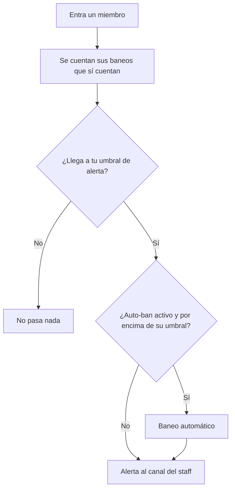

## Cuando baneas a alguien

<Steps>
  <Step title="Discord avisa al bot">
    Da igual cómo se haya hecho el baneo: a mano, con otro bot, o con un comando de moderación.
    El bot se entera igual.
  </Step>
  <Step title="El bot busca el motivo">
    Lee el registro de auditoría de tu servidor para recuperar el motivo real del baneo y quién
    lo ejecutó. Por eso conviene darle ese permiso — sin él, el baneo se guarda igual, pero como
    "Sin razón".
  </Step>
  <Step title="Se registra en la base compartida">
    Con el motivo, la fecha, y el servidor de origen **hasheado y cifrado** (ver
    [Privacidad](/blacklist/privacy)). Nunca en claro.
  </Step>
  <Step title="Se avisa al instante a quien lo tenga dentro">
    El bot recorre las demás comunidades protegidas y, si ese usuario ya es miembro de alguna,
    dispara ahí la alerta (y el auto-ban, si procede). No hay que esperar a que vuelva a entrar
    en ningún sitio.
  </Step>
</Steps>

<Note>
  Un mismo servidor no puede registrar dos veces el mismo baneo contra la misma persona en menos
  de **24 horas**. Es la protección anti-duplicados: banear, desbanear y volver a banear no
  infla el recuento de nadie.
</Note>

## Cuando alguien con historial entra en tu servidor

Los baneos marcados como [sospechosos](/blacklist/privacy#baneos-sospechosos) no entran en la cuenta, pero
la alerta te dice cuántos hay.

## Cuando desbaneas a alguien

El registro que **tú** aportaste desaparece de la base compartida. Es la forma de corregir un
error: desbanea en tu servidor y el baneo deja de contar para el resto de la red al momento.

Los baneos que otras comunidades hayan puesto contra esa persona siguen ahí, obviamente: cada
servidor gestiona los suyos.

## Cuando el bot sale de un servidor

Si expulsas el bot, **todos los baneos que aportó ese servidor se eliminan** de la base
compartida. Dejas de aportar y dejas de estar cubierto, en el mismo momento.

## Baneos que no cuentan

<AccordionGroup>
  <Accordion title="Baneos sospechosos">
    Los que vienen de servidores con **menos de 200 miembros**. Es la defensa contra las "granjas"
    de servidores desechables creados para inflar el historial de alguien. Se guardan, pero no
    cuentan ni para alertas ni para auto-ban.

    Si con el tiempo ese servidor crece por encima del umbral, sus baneos se **promocionan**
    automáticamente y pasan a contar como cualquier otro. El bot lo revisa cada 6 horas.
  </Accordion>
  <Accordion title="Servidores internos de EventsMC">
    Nuestros servidores de desarrollo y pruebas no sincronizan sus baneos: no queremos contaminar
    la base compartida con pruebas.
  </Accordion>
</AccordionGroup>

## Qué se guarda de cada baneo

| Dato | Cómo se guarda |
|---|---|
| Usuario baneado | ID de Discord, en claro (es lo que hay que poder consultar) |
| Motivo | Tal cual lo escribió el staff, o "Sin razón" |
| Fecha | Marca de tiempo |
| Servidor de origen | **Hash irreversible** (para deduplicar) + copia **cifrada** (solo para auditar abusos) |
| Staff que lo ejecutó | Hash irreversible |
| Sospechoso | Sí/no, según el tamaño del servidor de origen |

Todo el detalle, en [Privacidad](/blacklist/privacy).

## Qué pasa cuando el bot está caído

Las alertas se disparan en el momento del evento, así que un corte puede hacer que se pierda
alguna. Para eso está `/blacklist config scan`: revisa a todos tus miembros actuales de golpe y
te devuelve quién tiene baneos registrados, hayas recibido la alerta o no.

<Card title="Ajusta las alertas a tu comunidad" icon="bell" href="/alerts">
  Cuándo avisa exactamente, por qué solo una vez por usuario y cómo cambiar el umbral.
</Card>
