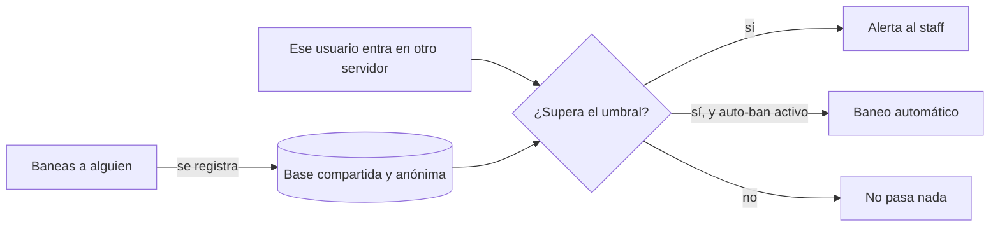

Events Blacklist sincroniza baneos entre todos los servidores de Discord que lo tengan activo,
manteniendo una base de datos compartida y **anónima**. Si alguien es un problema en una
comunidad, el resto de la red se entera — sin que se revele nunca de dónde viene el baneo.

No hay nada que instalar ni mantener: invita el bot, ejecuta un comando de configuración y ya
está protegiendo tu servidor.

<CardGroup cols={2}>
  <Card title="Sincronización automática" icon="arrows-rotate" href="/blacklist/how-it-works">
    Cuando baneas a alguien en tu servidor, se registra solo en la base compartida.
  </Card>
  <Card title="Alertas al staff" icon="triangle-exclamation" href="/blacklist/alerts">
    Si entra alguien con baneos en otras comunidades, tu equipo recibe un aviso en el canal que
    elijas.
  </Card>
  <Card title="Auto-ban opcional" icon="gavel" href="/blacklist/auto-ban">
    Expulsa automáticamente a quien acumule demasiados baneos. Desactivado por defecto.
  </Card>
  <Card title="Origen siempre anónimo" icon="user-secret" href="/blacklist/privacy">
    Ningún comando revela jamás en qué servidor fue baneado alguien.
  </Card>
</CardGroup>

## El problema que resuelve

Un usuario tóxico expulsado de una comunidad se muda a la siguiente y empieza de cero. El staff
del segundo servidor no tiene forma de saberlo… salvo que alguien se lo cuente.

Compartir listas de baneados a mano tiene dos pegas evidentes: es un trabajo constante, y expone
a quién baneó a quién (con el drama y las represalias que eso trae). Events Blacklist automatiza
lo primero y elimina lo segundo: los baneos se comparten, el origen no.

## Cómo funciona, en una imagen

## Lo que debes saber antes de empezar

<Warning>
  **La sincronización es obligatoria.** Si tienes el bot activo, los baneos que hagas se
  comparten con la red. No existe un modo de "solo recibir alertas sin aportar": el sistema
  funciona porque todos aportan.
</Warning>

<Info>
  **El bot no banea por su cuenta salvo que se lo pidas.** Por defecto solo avisa, y la decisión
  es siempre de tu staff. El [auto-ban](/blacklist/auto-ban) hay que activarlo a mano.
</Info>

## Por dónde empezar

<Steps>
  <Step title="Invita el bot">
    [Añádelo a tu servidor](https://discord.com/oauth2/authorize?client_id=1528203943367151706)
    con permiso para **banear miembros** y ver el **registro de auditoría**.
  </Step>
  <Step title="Configúralo en un paso">
    `/blacklist config setup` deja todo listo: canal de alertas, importación de tus baneos
    previos y escaneo de los miembros que ya tienes dentro.
  </Step>
  <Step title="Ajústalo a tu comunidad">
    La [Guía completa](/blacklist/guide) te ayuda a elegir umbrales y a decidir si activar el auto-ban.
  </Step>
</Steps>

<Info>
  ¿Dudas? Usa `/support` en Discord o entra en el
  [servidor de soporte de EventsMC](https://discord.eventsmc.xyz/).
</Info>

<Card title="¿Y para tu servidor de Minecraft?" icon="list-check" href="/whitelist/introduction">
  **Events Whitelist** gestiona la whitelist de tu servidor desde Discord. Se complementa con
  este bot y comparte el [programa de afiliados](/afiliados).
</Card>
