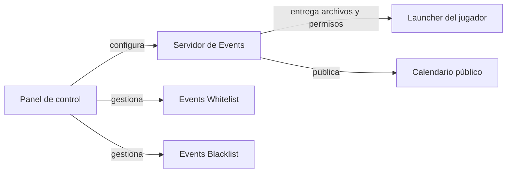

El **panel de control** de Events es la web desde la que se gestiona todo lo demás: las
instancias que reciben los jugadores en el launcher, el calendario de eventos, los bots de
Discord, las cuentas del equipo y los archivos alojados.

Está en <a href="https://panel.eventsmc.xyz" target="_blank">panel.eventsmc.xyz</a> y se entra
**con Discord**. No hay contraseñas: solo entran las cuentas de Discord dadas de alta.

<CardGroup cols={2}>
  <Card title="Instancias" icon="cubes" href="/panel/instances">
    La copia de Minecraft que recibe el jugador: versión, mods, archivos y aspecto.
  </Card>
  <Card title="Eventos" icon="calendar-days" href="/panel/events">
    El calendario público y la pestaña Explorar del launcher.
  </Card>
  <Card title="Equipo y studios" icon="users" href="/panel/team">
    Quién entra al panel, con qué rol y qué servicios tiene activados.
  </Card>
  <Card title="Archivos públicos" icon="folder-open" href="/panel/files">
    Imágenes, audio y documentos con URL pública permanente.
  </Card>
</CardGroup>

## Cómo está organizado

La barra lateral agrupa las secciones por lo que **son**, no por orden alfabético:

| Grupo | Qué contiene |
| --- | --- |
| **Launcher** | Inicio, Instancias, Eventos, Servidores, Nodos |
| **Bots de Discord** | Events Whitelist, Events Blacklist |
| **Hosting** | Servidores de juego — un enlace al panel aparte de hosting.eventsmc.xyz |
| **Plataforma** | Equipo, Studios, Suscripciones, Papelera |
| **Sistema** | Archivos públicos, Seguridad, Actividad, Ajustes |

Una sección que tu studio **no tiene contratada** sigue apareciendo, pero apagada y sin
respuesta al pulsarla. Esconderla del todo haría que nadie supiera que existe; enseñarla como
si funcionase haría que la API rechazara la acción sin explicar por qué.

## Qué necesitas para entrar

<Steps>
  <Step title="Que tu Discord tenga acceso">
    Alguien con permiso lo da de alta en **Equipo**. Si tu cuenta no está, el panel lo dice al
    intentar entrar.
  </Step>
  <Step title="Entrar con Discord">
    Un solo botón. No se te pide ninguna contraseña ni se guarda ninguna.
  </Step>
  <Step title="Decidir cuánto dura la sesión">
    La casilla **Mantener la sesión abierta** la alarga a 30 días en ese navegador, en lugar de
    las 12 horas normales. Ver [Sesión e idiomas](/panel/session).
  </Step>
</Steps>

## Cómo encaja con el resto

El panel **no** habla con el ordenador del jugador. Escribe en el servidor de Events, y es el
launcher el que consulta ese servidor cuando alguien abre una instancia. Por eso un cambio se
ve en el siguiente arranque del launcher, sin que nadie tenga que reinstalar nada.

## Idiomas

El panel está en **español, inglés, catalán y francés** — los mismos cuatro del launcher. Se
cambia desde el icono de idioma de la cabecera o desde **Ajustes → Apariencia**, y la elección
se recuerda en ese navegador.

## En el móvil

El panel funciona en el teléfono: la barra lateral se convierte en un menú lateral, las tablas
se desplazan solas y los formularios pasan a una columna. Está pensado para lo que de verdad se
hace desde el móvil durante un evento —mirar quién está conectado, expulsar a alguien, bloquear
una instancia— y no para subir un modpack de 500 MB.
