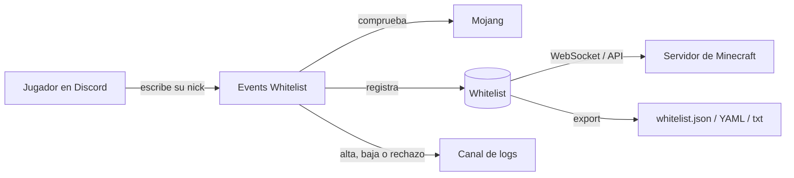

Events Whitelist gestiona la whitelist de tu servidor de Minecraft **desde Discord**: tus
jugadores escriben su nick en un canal, el bot comprueba contra Mojang si es una cuenta Premium
y lo registra automáticamente. Puedes tener varias whitelists a la vez (evento, beta, staff),
exportarlas en el formato que necesite tu servidor y, si quieres, conectar el servidor de
Minecraft para que se sincronice en tiempo real.

No hay nada que instalar ni mantener: el bot ya está funcionando. Solo tienes que invitarlo a
tu Discord y configurarlo con los comandos de esta documentación.

<CardGroup cols={2}>
  <Card title="Varias whitelists" icon="layer-group" href="/guide">
    Todas las que necesites — evento, beta, staff — cada una con su canal, su tipo de cuenta
    admitido y su límite de nicks.
  </Card>
  <Card title="Premium y No Premium" icon="user-check" href="/how-it-works">
    El bot comprueba automáticamente contra Mojang si un nick pertenece a una cuenta Premium.
  </Card>
  <Card title="Roles configurables" icon="user-shield" href="/roles">
    Exige un rol, bloquéalo, o intercambia roles automáticamente al verificarse.
  </Card>
  <Card title="Sincronización en tiempo real" icon="plug" href="/minecraft-plugin">
    Conecta tu servidor con el plugin oficial y olvídate de exportar nada a mano.
  </Card>
</CardGroup>

## ¿Qué puedes hacer con él?

- Crear una o varias whitelists, cada una con su propio canal de registro.
- Elegir si cada whitelist admite solo cuentas Premium, solo No Premium, o ambas.
- Elegir cómo se registra la gente: escribiendo el nick en el canal, o con un **panel de
  botones** que deja el canal limpio.
- Poner un límite de nicks por persona (de 1 a 50).
- Exigir o bloquear roles de Discord para registrarse, e incluso **intercambiar roles**
  automáticamente al verificarse — ver [Roles](/whitelist/roles).
- Recibir logs de altas, bajas y rechazos en el canal que quieras — ver [Logs](/whitelist/logs).
- Exportar la lista en `plain`, EasyWhitelist o `whitelist.json` — ver [Exportar](/whitelist/export).
- Conectar tu servidor de Minecraft con el [plugin oficial](/whitelist/minecraft-plugin), o con tu propia
  integración a través de la [API](/whitelist/api).

## Cómo encaja todo

## Por dónde empezar

<Steps>
  <Step title="Invita el bot">
    [Añádelo a tu servidor de Discord](https://discord.com/oauth2/authorize?client_id=1529559292938555405).
  </Step>
  <Step title="Monta tu primera whitelist">
    Sigue [Primeros pasos](/whitelist/quickstart): cinco minutos y ya está funcionando.
  </Step>
  <Step title="Afínalo a tu comunidad">
    La [Guía completa](/whitelist/guide) recorre roles, logs, límites y modos de registro con ejemplos
    reales.
  </Step>
  <Step title="Conecta tu servidor (opcional)">
    Con el [plugin de Minecraft](/whitelist/minecraft-plugin) la whitelist se aplica sola, en tiempo real.
  </Step>
</Steps>

<Info>
  ¿Dudas que no estén aquí? Usa `/support` en Discord o entra en el
  [servidor de soporte de EventsMC](https://discord.eventsmc.xyz/).
</Info>

<Card title="¿Y para moderar tu Discord?" icon="shield-halved" href="/blacklist/introduction">
  **Events Blacklist** te avisa cuando entra alguien con baneos en otras comunidades. Se
  complementa con este bot y comparte el [programa de afiliados](/afiliados).
</Card>
